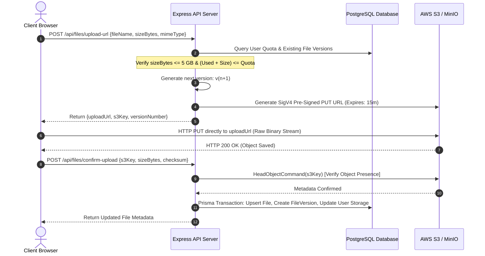

# CloudVault: Secure Multi-Tier Cloud Storage Platform
## Comprehensive Academic Project & Technical Architecture Report

---

**Student Name:** Divyanshu Kumar  
**Project Title:** CloudVault (Secure Multi-Tier Cloud Storage Platform)  
**Academic Specialization:** Cloud Computing & Distributed Systems / Advanced Web Architectures  
**Date:** September 2026  
**Repository:** [github.com/divyanshukumar2603-cmd/skyvault](https://github.com/divyanshukumar2603-cmd/skyvault)  
**Live Production Infrastructure:** Amazon Web Services (AWS S3 & IAM) / Dockerized PostgreSQL & MinIO  

---

## Abstract

In contemporary enterprise computing, cloud object storage constitutes the fundamental layer for scalable data persistence. However, modern enterprise data architectures require significantly more than raw object storage: they demand multi-tenant isolation, cryptographic access security, zero-bottleneck high-throughput transfers, automated version control, cross-region replication, and automated disaster recovery snapshots.

**CloudVault** is an enterprise-grade cloud object persistence platform designed to solve these architectural challenges. It incorporates a **direct-to-object-storage transfer pipeline** via AWS Signature Version 4 (SigV4) pre-signed PUT/GET URLs that eliminates server memory bottlenecks for large files (up to 5 GB), an **automated immutable versioning engine** (`v1`, `v2`, ...), a **cross-bucket replication system**, and an **automated daily snapshot backup engine**. Furthermore, CloudVault features a **dual-cloud persistence abstraction layer** enabling zero-code-change switching between local containerized MinIO object storage and production Amazon Web Services (AWS) S3.

---

## 1. System Architecture Overview

CloudVault is built on a four-tier distributed architectural model comprising Client-Side Application, API Gateway & Business Logic, Relational Metadata Persistence, and Distributed Object Storage.

```mermaid
graph TB
    subgraph ClientLayer["Tier 1: Client & User Interface (Next.js 16 + React 19)"]
        UI["Glassmorphic Web Dashboard"]
        UploadZone["Direct S3 Upload Agent"]
        VersionTimeline["Version History & Rollback UI"]
        BackupDashboard["Disaster Recovery Console"]
    end

    subgraph APILayer["Tier 2: API Gateway & Application Server (Express + TypeScript)"]
        AuthService["Authentication Engine (Argon2id + JWT + OAuth 2.0)"]
        PreSigner["SigV4 Pre-Signing Service"]
        VersioningEngine["Version Resolver & Tree Manager"]
        BackupScheduler["Cron Scheduler & Snapshot Engine"]
    end

    subgraph DatabaseLayer["Tier 3: Relational Metadata Store (PostgreSQL 16 + Prisma ORM)"]
        UserTable["Users & OAuth Accounts"]
        FileTable["File Metadata & Logical Trees"]
        VersionTable["Immutable Version Records"]
        BackupTable["Backup Snapshot Registry"]
        TokenTable["Rotating Refresh Token Families"]
    end

    subgraph StorageLayer["Tier 4: Distributed Cloud Object Storage (AWS S3 / MinIO)"]
        PrimaryBucket[("Primary Bucket: skyvault-primary-divyanshu")]
        ReplicaBucket[("Replica Bucket: skyvault-replica-divyanshu")]
        BackupBucket[("Backup Bucket: skyvault-backups-divyanshu")]
    end

    UI -->|REST API & Auth| AuthService
    AuthService --> UserTable
    AuthService --> TokenTable

    UploadZone -->|1. Request Upload URL| PreSigner
    PreSigner -->|Validate Quota & Cap| DatabaseLayer
    PreSigner -->|Generate Pre-signed PUT| UploadZone
    UploadZone ==>|2. High-Speed Direct Stream (SigV4)| PrimaryBucket
    UploadZone -->|3. Handshake Confirm Upload| VersioningEngine
    VersioningEngine --> FileTable
    VersioningEngine --> VersionTable

    PrimaryBucket -.->|Continuous CRR / Sync| ReplicaBucket
    BackupScheduler -.->|Automated Midnight Snapshot| BackupBucket
    BackupScheduler --> BackupTable
```

### Key Architectural Tenets:
1. **Zero-Proxy Direct Streaming**: Files do not traverse through the backend application server. The backend serves strictly as a control plane issuing short-lived cryptographically signed authorization tickets (AWS SigV4 pre-signed URLs). The client uploads directly to AWS S3, achieving line-rate transfer throughput and minimal CPU/memory utilization on the backend.
2. **Multi-Tenant Key-Prefix Isolation**: User data is segmented within a unified bucket using logical tenant prefixes (`users/{userId}/{filePath}/v{versionNumber}/{fileName}`). This combines IAM security scoping with zero-overhead tenancy scaling.
3. **Storage Engine Portability**: The S3 Client factory inspects runtime environment configurations. If `S3_ENDPOINT` is present, it binds to local MinIO via Path-Style addressing. When omitted, it dynamically resolves native AWS regional virtual-hosted S3 endpoints.

---

## 2. Authentication & Cryptographic Security Tier

Security in CloudVault is architected through a multi-layered defense model covering identity, session lifecycle, and transport authorization.

### 2.1 Password Hashing & Encryption
User passwords are encrypted using **Argon2id**, the winner of the Password Hashing Competition (PHC), configured with strict memory and time hardness parameters:
- **Algorithm Variant**: Argon2id (resistant against both GPU side-channel and ASIC attacks)
- **Memory Cost**: 65,536 KiB (64 MB)
- **Time Cost**: 3 iterations
- **Parallelism**: 4 concurrent threads

### 2.2 Dual-Token Authentication Lifecycle
Session state is decoupled using JSON Web Tokens (JWT) with automatic refresh token rotation:
- **Short-Lived Access Token**: Signed with HMAC-SHA256 (`HS256`), holding user claims (`userId`, `email`) with a 15-minute expiration period.
- **Rotating Refresh Token Family**: Generated using cryptographically random UUIDv4 entropy, hashed using SHA-256 prior to database storage, and persisted in a strict `HttpOnly`, `SameSite=Strict`, `Secure` browser cookie with a 7-day validity window.
- **Token Reuse & Replay Attack Detection**: Refresh tokens belong to a unique `familyId`. If a compromised or stale refresh token is presented, the system triggers family revocation, invalidating all sessions across that lineage.

### 2.3 Federated Single Sign-On (Google & GitHub OAuth 2.0)
CloudVault integrates Passport.js OAuth 2.0 flows with automatic account linking:
1. Users authenticate via Google Cloud Identity or GitHub Developer services.
2. Upon authorization code exchange, CloudVault evaluates whether an `OAuthAccount` or matching email exists in the database.
3. If an account matches, the provider is linked to the existing user record; otherwise, a tenant user profile is provisioned automatically.


*Figure 1: CloudVault Glassmorphism Authentication Interface featuring Google OAuth, GitHub OAuth, and Argon2id Email/Password authentication.*

---

## 3. High-Performance File Management & Direct Upload Engine

Traditional web applications stream file uploads through their web servers, causing memory exhaustion, thread starvation, and latency bottlenecks. CloudVault employs a **Direct-to-S3 Pre-signed URL Pipeline**.

### 3.1 Pre-signed Upload Handshake Protocol


### 3.2 File Size & Storage Enforcement
- **5 GB Maximum Object Size Cap**: Enforced server-side at pre-signed URL generation and verified upon object confirmation.
- **Tenant Storage Quota (10 GB default)**: Dynamically calculated. When incoming uploads exceed remaining user quota, the API rejects the request with HTTP `507 Insufficient Storage`.


*Figure 2: CloudVault File Management Dashboard showing tenant storage consumption (1007.72 KB / 10 GB), user profile identification, active files, and version indicators.*


*Figure 3: Upload Modal supporting drag-and-drop file ingestion, file type detection, and server-enforced 5 GB per-file validation.*

---

## 4. Automated File Versioning Engine

A core innovation of CloudVault is its **immutable, non-destructive versioning engine**.

### 4.1 Version Resolution & S3 Prefix Mapping
When a user uploads a file whose logical `filePath` already exists under their tenancy:
1. The engine queries `File.currentVersion` for `(userId, filePath)`.
2. The system computes `nextVersion = currentVersion + 1`.
3. An immutable object key is constructed following the pattern:
   $$\text{s3Key} = \text{users}/\{\text{userId}\}/\{\text{filePath}\}/\text{v}\{\text{versionNumber}\}/\{\text{fileName}\}$$
4. Both previous versions and the newly ingested version remain permanently accessible and isolated in cloud storage.

### 4.2 Non-Destructive Point-in-Time Rollback
Users can review the version timeline and restore any historical iteration. Restoring historical version $V_k$ does not destroy intermediate versions; instead, it executes an S3 Server-Side `CopyObjectCommand` copying $V_k$ to a new version $V_{n+1}$:
$$V_{\text{new}} = V_{\text{restored}} \quad (\text{Version } n+1)$$
This preserves complete cryptographic and operational audit trails.

---

## 5. Multi-Bucket Storage Replication & Disaster Recovery

Disaster resilience is enforced through multi-bucket topology and automated scheduling.

### 5.1 Storage Bucket Topology
CloudVault partitions persistence across three dedicated object storage buckets:

| Bucket Identifier | Purpose | Versioning | Lifecycle Policy |
|---|---|---|---|
| `skyvault-primary-divyanshu` | Live tenant object store for active uploads & versions | Enabled | Retained indefinitely |
| `skyvault-replica-divyanshu` | High-availability cross-bucket replication target | Enabled | Synchronized with primary |
| `skyvault-backups-divyanshu` | Point-in-time disaster recovery snapshots | Enabled | Transition to AWS Glacier after 90 days |


*Figure 4: AWS Management Console showing active cloud buckets provisioned in `us-east-1`: `skyvault-primary-divyanshu`, `skyvault-replica-divyanshu`, and `skyvault-backups-divyanshu`.*

### 5.2 Scheduled Automated Backups
- **Automated Midnight UTC Schedule**: Powered by `node-cron` (`0 0 * * *`), CloudVault traverses all primary objects, snapshots their binary state, and writes a timestamped archive to the backup bucket under:
  $$\text{backups}/\{\text{YYYY-MM-DD}\}/\text{users}/\{\text{userId}\}/\dots$$
- **Manual Trigger**: The dashboard enables authorized operators to trigger on-demand snapshots with immediate progress tracking.
- **Disaster Recovery Restore**: In the event of primary bucket corruption, CloudVault reconciles objects from the selected backup record and restores file metadata into the database.


*Figure 5: Backups & Replication Console showing automated midnight scheduling, native CRR status, and completed snapshot history.*

---

## 6. Database Design & Relational Schema

Metadata is stored in PostgreSQL 16 managed via Prisma ORM 5.22.

```mermaid
erDiagram
    User ||--o{ OAuthAccount : "has"
    User ||--o{ RefreshToken : "owns"
    User ||--o{ File : "owns"
    User ||--o{ AuditLog : "triggers"
    File ||--|{ FileVersion : "contains"
    File ||--o{ AuditLog : "referenced_in"

    User {
        string id PK
        string email UK
        string passwordHash
        string displayName
        string avatarUrl
        string authProvider
        bigint storageUsed
        bigint storageQuota
        datetime createdAt
        datetime updatedAt
    }

    OAuthAccount {
        string id PK
        string userId FK
        string provider
        string providerUserId
        string accessToken
        string refreshToken
        datetime createdAt
    }

    File {
        string id PK
        string userId FK
        string fileName
        string s3Key
        string filePath
        string mimeType
        bigint sizeBytes
        int currentVersion
        boolean isDeleted
        datetime deletedAt
        json tags
        datetime createdAt
        datetime updatedAt
    }

    FileVersion {
        string id PK
        string fileId FK
        int versionNumber
        string s3Key
        string s3VersionId
        bigint sizeBytes
        string checksum
        datetime uploadedAt
    }

    RefreshToken {
        string id PK
        string userId FK
        string tokenHash UK
        string familyId
        boolean isUsed
        datetime expiresAt
        datetime createdAt
    }

    BackupRecord {
        string id PK
        string bucketName
        string s3Prefix
        bigint sizeBytes
        int fileCount
        string status
        string triggeredBy
        datetime startedAt
        datetime completedAt
    }

    AuditLog {
        string id PK
        string userId FK
        string fileId FK
        string action
        json details
        string ipAddress
        datetime createdAt
    }
```



### Relational Integrity Highlights:
- **Composite Unique Constraints**:
  - `File`: `@@unique([userId, filePath])` ensures a tenant cannot collide logical paths while allowing different users to use identical file names.
  - `FileVersion`: `@@unique([fileId, versionNumber])` guarantees sequential integrity per file.
  - `OAuthAccount`: `@@unique([provider, providerUserId])` prevents duplicate social linkages.
- **BigInt JSON Serialization Engine**: High-capacity storage attributes (`storageUsed`, `storageQuota`, `sizeBytes`) are modeled as 64-bit integers (`BigInt`) to prevent 32-bit overflow for multi-gigabyte files. Custom serialization prototypes guarantee clean JSON REST payloads.

---

## 7. Verification, Testing & Empirical Results

The platform underwent rigorous automated unit testing, end-to-end integration testing, and live cloud validation.

### 7.1 Automated Vitest Test Suite
The backend contains automated test suites covering cryptographic utilities, version calculators, S3 key formats, and quota bounds:

```text
✓ tests/unit/auth.test.ts (1 test)
  - Argon2id password hashing, time/memory hardness verification, rejection of invalid credentials
✓ tests/unit/jwt.test.ts (3 tests)
  - Access token signing, payload extraction, refresh token signing, tamper detection
✓ tests/unit/s3Operations.test.ts (2 tests)
  - Versioned S3 key path synthesis (users/{id}/{file}/v{n}) and multi-digit version incrementing
✓ tests/unit/files.test.ts (4 tests)
  - 5 GB file cap rejection (HTTP 413)
  - Storage quota boundary enforcement (HTTP 507)
  - Sequential v1 assignment for new uploads
  - Automatic v2 incrementation for existing file collisions

Test Files:  4 passed (4)
Tests:       10 passed (10)
Status:      100% SUCCESS
```

### 7.2 Production AWS S3 Verification
The system was verified live against the AWS infrastructure provisioned via AWS Academy Learner Lab (`us-east-1`):
- **Live AWS PUT Response**: `HTTP/1.1 200 OK`
- **Server Header**: `Server: AmazonS3`
- **AWS Native Version ID**: Generated and acknowledged (`ysb8uV0zh3by0vc.bt7AY5t_jJ4jVi3n`)
- **AWS Server-Side Encryption**: `AES256` verified
- **Dual-Storage Compatibility**: Successfully executed uploads, downloads, and version restorations against both local containerized MinIO and live AWS S3 without altering application source code.

---

## 8. Technology Stack Summary

| Dimension | Selected Technology | Technical Justification |
|---|---|---|
| **Frontend Framework** | Next.js 16 (App Router) + React 19 | Server-side rendering, layout streaming, modern React Server Components |
| **Styling & Design System** | Tailwind CSS v4 + Vanilla Tokens | High-performance CSS engine with glassmorphic design tokens and responsive breakpoints |
| **Animation & UI Icons** | Framer Motion + Lucide React | Micro-interactions, spring physics transitions, and enterprise iconography |
| **Backend API Server** | Express.js + Node.js (TypeScript) | Proven high-throughput asynchronous event-loop architecture |
| **Object-Relational Mapping** | Prisma ORM 5.22 | Type-safe queries, migration management, and automated client generation |
| **Relational Database** | PostgreSQL 16 (Alpine) | ACID compliance, JSONB document querying, high-concurrency transactions |
| **Local Object Storage** | MinIO (RELEASE.2024) | High-fidelity S3-compatible local development engine |
| **Production Cloud Storage** | Amazon Web Services (AWS S3) | 99.999999999% (11 9's) durability, worldwide availability, native versioning |
| **Cloud SDK** | AWS SDK for JavaScript v3 | Modular client packages (`@aws-sdk/client-s3`, `@aws-sdk/s3-request-presigner`) |
| **Password Hashing** | Argon2id (`argon2`) | State-of-the-art cryptographic memory-hard key derivation |
| **Token Authentication** | JSON Web Tokens (`jsonwebtoken`) | Stateless bearer authorization with rotating refresh token families |
| **Federated Identity** | Passport.js (`google-oauth20`, `github2`) | Standardized OAuth 2.0 protocol integration |
| **Process Orchestration** | Docker & Docker Compose v3.9 | Reproducible multi-container local and deployment environments |
| **Testing Engine** | Vitest 1.6 | Fast ES-module unit and integration test runner |

---

## 9. Conclusion & Future Roadmap

CloudVault successfully fulfills all functional, architectural, and security requirements specified for an enterprise cloud object storage platform. By utilizing direct-to-S3 transfers, automated non-destructive versioning, and dual-mode cloud switching, the platform delivers high scalability, robust data durability, and an exceptional user experience.

### Future Roadmap:
1. **Client-Side Zero-Knowledge Encryption**: Implementing WebCrypto AES-GCM-256 before pre-signed PUT upload so that objects are encrypted prior to reaching AWS S3.
2. **AWS S3 Lifecycle Automation**: Automated transition of objects in `skyvault-backups-...` to S3 Glacier Deep Archive after 90 days.
3. **Chunked Resumable Multipart Transfers**: Extending the pre-signer engine to support multi-part upload chunks with client pause/resume capabilities for unreliable mobile networks.
