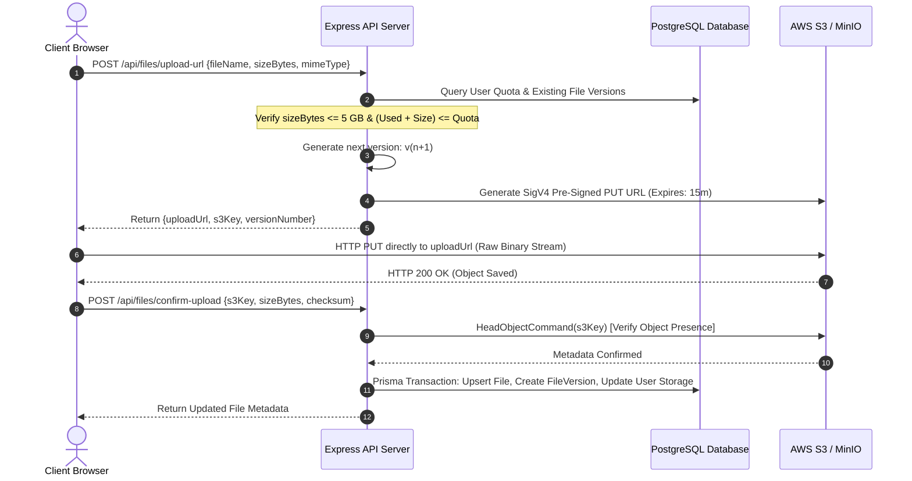
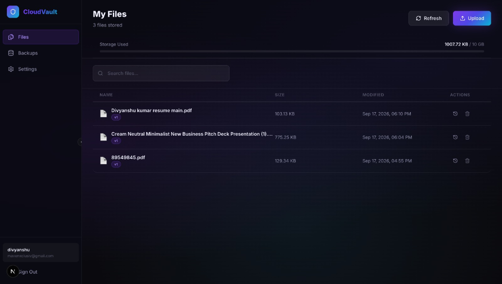
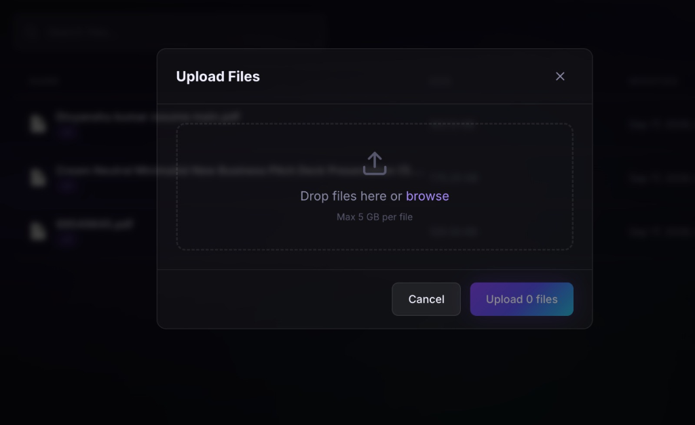
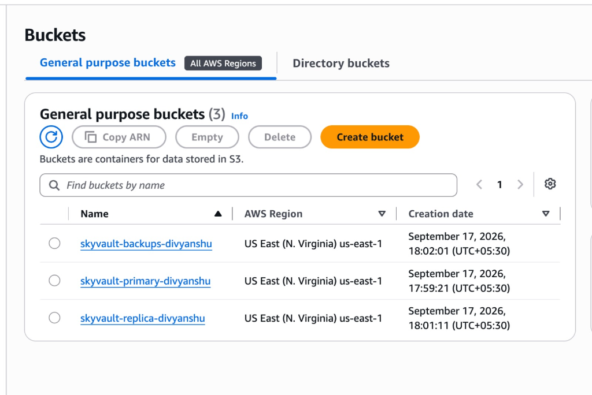
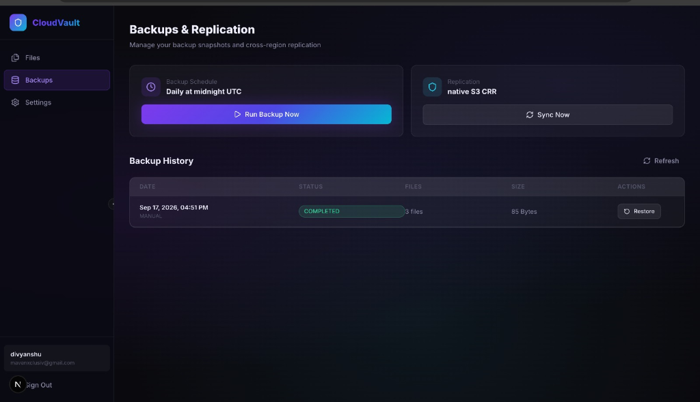
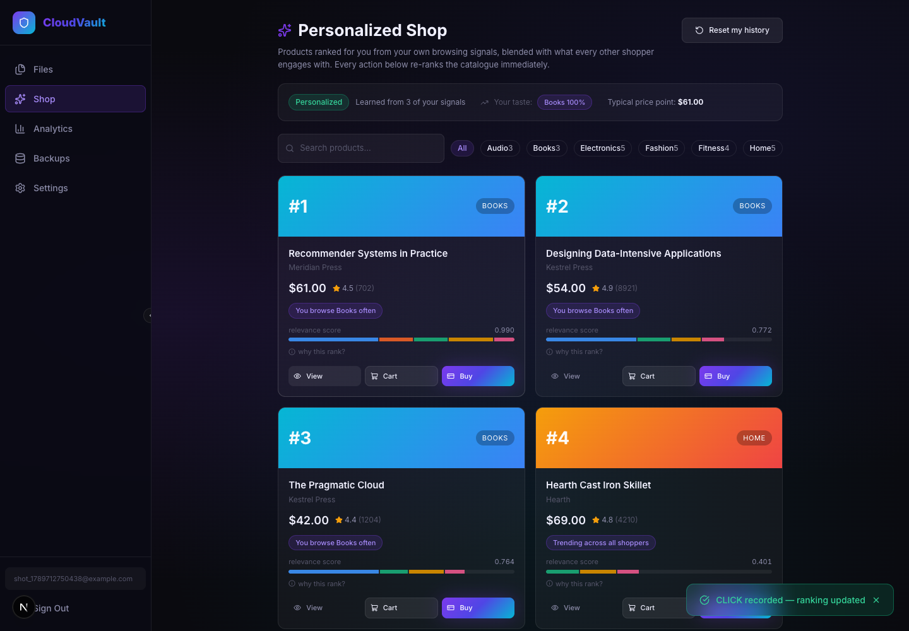
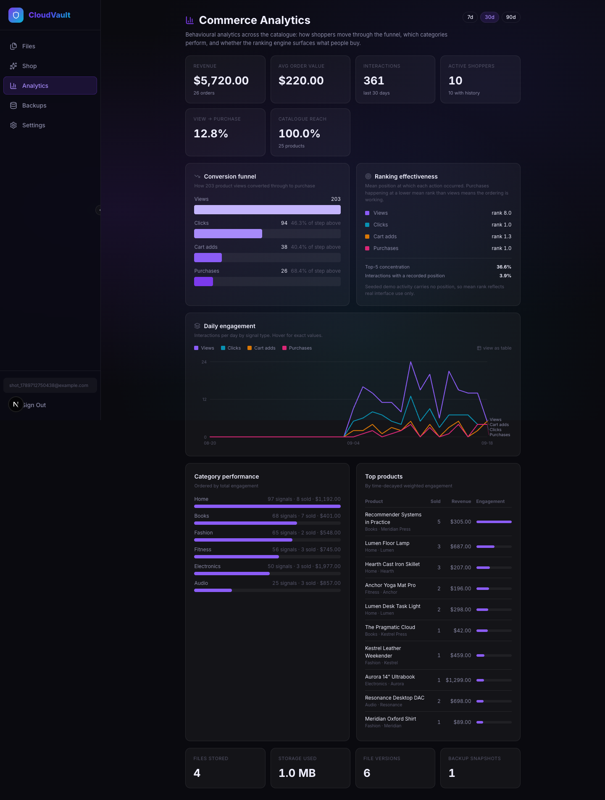
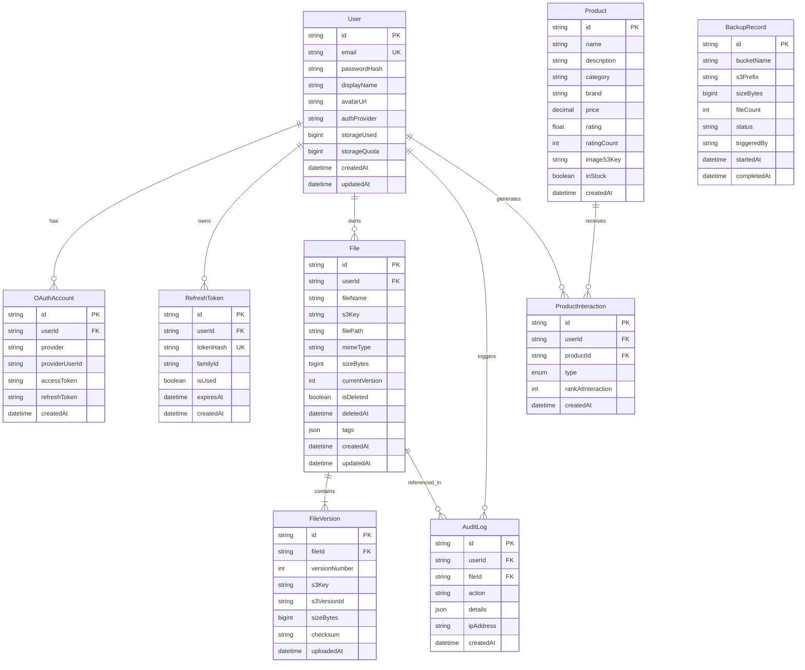

# CloudVault: A Secure Analytical eCommerce Platform on AWS
## Comprehensive Academic Project & Technical Architecture Report

---

**Student Name:** Divyanshu Kumar  
**Project Title:** CloudVault (Secure Analytical eCommerce Platform with Personalized Product Ranking)  
**Project Aim:** Develop a secure analytical platform for eCommerce using AWS services, comprising a personalized eCommerce product ranking system  
**Academic Specialization:** Cloud Computing & Distributed Systems / Advanced Web Architectures  
**Date:** September 2026  
**Repository:** [github.com/divyanshukumar2603-cmd/skyvault](https://github.com/divyanshukumar2603-cmd/skyvault)  
**Live Production Infrastructure:** Amazon Web Services (AWS S3 & IAM) / Dockerized PostgreSQL & MinIO  

---

## Abstract

In contemporary enterprise computing, cloud object storage constitutes the fundamental layer for scalable data persistence. However, modern enterprise data architectures require significantly more than raw object storage: they demand multi-tenant isolation, cryptographic access security, zero-bottleneck high-throughput transfers, automated version control, cross-region replication, and automated disaster recovery snapshots.

**CloudVault** is an enterprise-grade cloud object persistence platform designed to solve these architectural challenges. It incorporates a **direct-to-object-storage transfer pipeline** via AWS Signature Version 4 (SigV4) pre-signed PUT/GET URLs that eliminates server memory bottlenecks for large files (up to 5 GB), an **automated immutable versioning engine** (`v1`, `v2`, ...), a **cross-bucket replication system**, and an **automated daily snapshot backup engine**. Furthermore, CloudVault features a **dual-cloud persistence abstraction layer** enabling zero-code-change switching between local containerized MinIO object storage and production Amazon Web Services (AWS) S3.

On top of this secure storage substrate, CloudVault implements an **analytical personalization tier**: a **personalized eCommerce product ranking engine** that observes user behaviour (views, clicks, cart additions and purchases), builds a time-decayed taste profile per user, and reorders the product catalogue accordingly. Ranking blends five weighted signals — category affinity, brand affinity, price fit, global popularity and product rating — and degrades gracefully to a popularity-driven cold-start path for users with no history. Every ranked result carries a transparent score breakdown, so the platform explains *why* each product occupies its position rather than presenting an opaque ordering.

Alongside it sits a **behavioural analytics layer** reading the same interaction log: conversion funnels with per-stage drop-off, category and catalogue performance, daily engagement trends, and a set of measures by which the ranking engine is held to account — mean rank per action, catalogue coverage and engagement concentration. The platform therefore does not merely claim its personalization works; it measures it.

---

## 1. System Architecture Overview

CloudVault is built on a four-tier distributed architectural model comprising Client-Side Application, API Gateway & Business Logic, Relational Metadata Persistence, and Distributed Object Storage. The analytical personalization tier spans Tiers 1–3: behavioural signals are captured in the UI, scored by the ranking engine in the application tier, and persisted in the relational store.

```mermaid
graph TB
    subgraph ClientLayer["Tier 1: Client & User Interface (Next.js 16 + React 19)"]
        UI["Glassmorphic Web Dashboard"]
        UploadZone["Direct S3 Upload Agent"]
        VersionTimeline["Version History & Rollback UI"]
        BackupDashboard["Disaster Recovery Console"]
        ShopUI["Personalized Shop & Ranking Explorer"]
        AnalyticsUI["Commerce Analytics Dashboard"]
    end

    subgraph APILayer["Tier 2: API Gateway & Application Server (Express + TypeScript)"]
        AuthService["Authentication Engine (Argon2id + JWT + OAuth 2.0)"]
        PreSigner["SigV4 Pre-Signing Service"]
        VersioningEngine["Version Resolver & Tree Manager"]
        BackupScheduler["Cron Scheduler & Snapshot Engine"]
        RankingEngine["Personalization & Ranking Engine"]
        AnalyticsEngine["Behavioural Analytics Engine"]
    end

    subgraph DatabaseLayer["Tier 3: Relational Metadata Store (PostgreSQL 16 + Prisma ORM)"]
        UserTable["Users & OAuth Accounts"]
        FileTable["File Metadata & Logical Trees"]
        VersionTable["Immutable Version Records"]
        BackupTable["Backup Snapshot Registry"]
        TokenTable["Rotating Refresh Token Families"]
        ProductTable["Product Catalogue"]
        InteractionTable["Behavioural Interaction Log"]
    end

    subgraph StorageLayer["Tier 4: Distributed Cloud Object Storage (AWS S3 / MinIO)"]
        PrimaryBucket[("Primary Bucket: skyvault-primary-divyanshu")]
        ReplicaBucket[("Replica Bucket: skyvault-replica-divyanshu")]
        BackupBucket[("Backup Bucket: skyvault-backups-divyanshu")]
    end

    UI -->|REST API & Auth| AuthService
    AuthService --> UserTable
    AuthService --> TokenTable

    UploadZone -->|1. Request Upload URL| PreSigner
    PreSigner -->|Validate Quota & Cap| DatabaseLayer
    PreSigner -->|Generate Pre-signed PUT| UploadZone
    UploadZone ==>|2. High-Speed Direct Stream (SigV4)| PrimaryBucket
    UploadZone -->|3. Handshake Confirm Upload| VersioningEngine
    VersioningEngine --> FileTable
    VersioningEngine --> VersionTable

    ShopUI -->|Ranked Catalogue Request| RankingEngine
    ShopUI -->|Behavioural Signal VIEW/CLICK/CART/PURCHASE| RankingEngine
    RankingEngine --> ProductTable
    RankingEngine --> InteractionTable
    AnalyticsUI -->|Funnel · Trends · Effectiveness| AnalyticsEngine
    AnalyticsEngine --> InteractionTable
    AnalyticsEngine --> ProductTable

    PrimaryBucket -.->|Native S3 Replication| ReplicaBucket
    BackupScheduler -.->|Automated Midnight Snapshot| BackupBucket
    BackupScheduler --> BackupTable
```

### Key Architectural Tenets:
1. **Zero-Proxy Direct Streaming**: Files do not traverse through the backend application server. The backend serves strictly as a control plane issuing short-lived cryptographically signed authorization tickets (AWS SigV4 pre-signed URLs). The client uploads directly to AWS S3, achieving line-rate transfer throughput and minimal CPU/memory utilization on the backend.
2. **Multi-Tenant Key-Prefix Isolation**: User data is segmented within a unified bucket using logical tenant prefixes (`users/{userId}/{filePath}/v{versionNumber}/{fileName}`). This combines IAM security scoping with zero-overhead tenancy scaling.
3. **Storage Engine Portability**: The S3 Client factory inspects runtime environment configurations. If `S3_ENDPOINT` is present, it binds to local MinIO via Path-Style addressing. When omitted, it dynamically resolves native AWS regional virtual-hosted S3 endpoints.

---

## 2. Authentication & Cryptographic Security Tier

Security in CloudVault is architected through a multi-layered defense model covering identity, session lifecycle, and transport authorization.

### 2.1 Password Hashing & Encryption
User passwords are encrypted using **Argon2id**, the winner of the Password Hashing Competition (PHC), configured with strict memory and time hardness parameters:
- **Algorithm Variant**: Argon2id (resistant against both GPU side-channel and ASIC attacks)
- **Memory Cost**: 65,536 KiB (64 MB)
- **Time Cost**: 3 iterations
- **Parallelism**: 4 concurrent threads

### 2.2 Dual-Token Authentication Lifecycle
Session state is decoupled using JSON Web Tokens (JWT) with automatic refresh token rotation:
- **Short-Lived Access Token**: Signed with HMAC-SHA256 (`HS256`), holding user claims (`userId`, `email`) with a 15-minute expiration period.
- **Rotating Refresh Token Family**: Generated using cryptographically random UUIDv4 entropy, hashed using SHA-256 prior to database storage, and persisted in a strict `HttpOnly`, `SameSite=Strict`, `Secure` browser cookie with a 7-day validity window.
- **Token Reuse & Replay Attack Detection**: Refresh tokens belong to a unique `familyId`. If a compromised or stale refresh token is presented, the system triggers family revocation, invalidating all sessions across that lineage.

### 2.3 Federated Single Sign-On (Google & GitHub OAuth 2.0)
CloudVault integrates Passport.js OAuth 2.0 flows with automatic account linking:
1. Users authenticate via Google Cloud Identity or GitHub Developer services.
2. Upon authorization code exchange, CloudVault evaluates whether an `OAuthAccount` or matching email exists in the database.
3. If an account matches, the provider is linked to the existing user record; otherwise, a tenant user profile is provisioned automatically.


*Figure 1: CloudVault Glassmorphism Authentication Interface featuring Google OAuth, GitHub OAuth, and Argon2id Email/Password authentication.*

---

## 3. High-Performance File Management & Direct Upload Engine

Traditional web applications stream file uploads through their web servers, causing memory exhaustion, thread starvation, and latency bottlenecks. CloudVault employs a **Direct-to-S3 Pre-signed URL Pipeline**.

### 3.1 Pre-signed Upload Handshake Protocol


### 3.2 File Size & Storage Enforcement
- **5 GB Maximum Object Size Cap**: Enforced server-side at pre-signed URL generation and verified upon object confirmation.
- **Tenant Storage Quota (10 GB default)**: Dynamically calculated. When incoming uploads exceed remaining user quota, the API rejects the request with HTTP `507 Insufficient Storage`.


*Figure 2: CloudVault File Management Dashboard showing tenant storage consumption (1007.72 KB / 10 GB), user profile identification, active files, and version indicators.*


*Figure 3: Upload Modal supporting drag-and-drop file ingestion, file type detection, and server-enforced 5 GB per-file validation.*

---

## 4. Automated File Versioning Engine

A core innovation of CloudVault is its **immutable, non-destructive versioning engine**.

### 4.1 Version Resolution & S3 Prefix Mapping
When a user uploads a file whose logical `filePath` already exists under their tenancy:
1. The engine queries `File.currentVersion` for `(userId, filePath)`.
2. The system computes `nextVersion = currentVersion + 1`.
3. An immutable object key is constructed following the pattern:
   $$\text{s3Key} = \text{users}/\{\text{userId}\}/\{\text{filePath}\}/\text{v}\{\text{versionNumber}\}/\{\text{fileName}\}$$
4. Both previous versions and the newly ingested version remain permanently accessible and isolated in cloud storage.

### 4.2 Non-Destructive Point-in-Time Rollback
Users can review the version timeline and restore any historical iteration. Restoring historical version $V_k$ does not destroy intermediate versions; instead, it executes an S3 Server-Side `CopyObjectCommand` copying $V_k$ to a new version $V_{n+1}$:
$$V_{\text{new}} = V_{\text{restored}} \quad (\text{Version } n+1)$$
This preserves complete cryptographic and operational audit trails.

---

## 5. Multi-Bucket Storage Replication & Disaster Recovery

Disaster resilience is enforced through multi-bucket topology and automated scheduling.

### 5.1 Storage Bucket Topology
CloudVault partitions persistence across three dedicated object storage buckets:

| Bucket Identifier | Purpose | Versioning | Lifecycle Policy |
|---|---|---|---|
| `skyvault-primary-divyanshu` | Live tenant object store for active uploads & versions | Enabled | Retained indefinitely |
| `skyvault-replica-divyanshu` | High-availability replication target (same-region; cross-region by repointing the rule) | Enabled | Native S3 replication rule `replicate-all-to-replica` |
| `skyvault-backups-divyanshu` | Point-in-time disaster recovery snapshots | Enabled | Transition to AWS Glacier after 90 days |


*Figure 4: AWS Management Console showing active cloud buckets provisioned in `us-east-1`: `skyvault-primary-divyanshu`, `skyvault-replica-divyanshu`, and `skyvault-backups-divyanshu`.*

### 5.2 Scheduled Automated Backups
- **Automated Midnight UTC Schedule**: Powered by `node-cron` (`0 0 * * *`), CloudVault traverses all primary objects, snapshots their binary state, and writes a timestamped archive to the backup bucket under:
  $$\text{backups}/\{\text{YYYY-MM-DD}\}/\text{users}/\{\text{userId}\}/\dots$$
- **Manual Trigger**: The dashboard enables authorized operators to trigger on-demand snapshots with immediate progress tracking.
- **Disaster Recovery Restore**: In the event of primary bucket corruption, CloudVault reconciles objects from the selected backup record and restores file metadata into the database.


*Figure 5: Backups & Replication Console showing automated midnight scheduling, native replication status, and completed snapshot history.*

### 5.3 Native S3 Replication Configuration
Replication is delegated to AWS itself rather than emulated in application code. A bucket-level replication rule (`replicate-all-to-replica`, priority 1, delete-marker replication enabled) copies every new object from the primary bucket to the replica bucket, authorised by an IAM role passed at configuration time. Both buckets have versioning enabled, which AWS requires for replication.

The application detects this at boot: `getNativeReplicationRules()` queries the live bucket configuration and reports the true mode. Where no native rule exists — local MinIO, or an AWS bucket that has not been configured — the platform automatically falls back to its own five-minute reconciliation loop, so replication is never silently absent.

**Measured replication latency (live AWS, `us-east-1`):**

```text
t+0s    PUT object to skyvault-primary-divyanshu
t+6s    primary ReplicationStatus = PENDING     replica: absent
t+12s   primary ReplicationStatus = PENDING     replica: absent
t+18s   primary ReplicationStatus = COMPLETED   replica: present (identical size)
```

Note that AWS replication applies only to objects written *after* the rule is created; pre-existing objects are back-filled through the application's own sync endpoint.

---

## 6. Personalized eCommerce Product Ranking Engine

The analytical core of the platform. The engine answers one question for every visitor: *given everything this person has done, and everything every other shopper has done, in what order should this catalogue appear?*

### 6.1 Behavioural Signal Model

Personalization is driven by four interaction types, each carrying a weight proportional to the intent it demonstrates. A purchase is a far stronger statement of preference than a passing glance:

| Signal | Weight | Interpretation |
|---|---|---|
| `VIEW` | 1 | Product appeared and was looked at |
| `CLICK` | 3 | Deliberate inspection |
| `CART` | 6 | Strong purchase intent |
| `PURCHASE` | 10 | Confirmed preference |

Signals are never pre-aggregated into a stored score. They are retained as an immutable log (`ProductInteraction`) and scored at query time, which means the model can be re-tuned — weights changed, decay adjusted — without rewriting history.

### 6.2 Temporal Decay

Consumer taste is not static, so old behaviour must not dominate current intent indefinitely. Every signal's contribution decays exponentially with a **seven-day half-life**:

$$w_{\text{effective}} = w_{\text{type}} \times 2^{-\frac{\Delta t_{\text{days}}}{7}}$$

An interaction from today contributes its full weight; one from a week ago contributes half; one from a month ago contributes roughly 5%. Interactions older than 90 days are excluded from the query entirely, as their residual influence is negligible.

### 6.3 User Taste Profile

For each user, the weighted signals collapse into a profile:

- **Category affinity** $A_c$ — summed effective weight per category, normalised so the strongest category equals 1.0
- **Brand affinity** $A_b$ — the same computation, per brand
- **Preferred price** $\mu_p$ — the weight-weighted mean price of engaged products
- **Price spread** $\sigma_p$ — the weighted standard deviation, capturing how broad the user's range is

### 6.4 Scoring Function

A product's relevance score is a weighted linear blend of five signals:

$$S(p, u) = 0.40 \cdot A_c(p) + 0.15 \cdot A_b(p) + 0.15 \cdot F_{\text{price}}(p) + 0.20 \cdot P(p) + 0.10 \cdot \frac{r_p}{5}$$

where:

- $F_{\text{price}}$ is a **Gaussian price fit**, peaking where the price matches the user's habits and widening for users with broad spending ranges:

$$F_{\text{price}}(p) = \exp\left(-\frac{(price_p - \mu_p)^2}{2\sigma^2}\right), \quad \sigma = \max(\sigma_p,\; 0.5\mu_p,\; 1)$$

- $P(p)$ is **log-damped global popularity**, normalised against the busiest product, so that one runaway item cannot flatten the rest of the catalogue:

$$P(p) = \frac{\ln(1 + W_p)}{\max_q \ln(1 + W_q)}, \quad W_p = \sum_{\text{all users}} w_{\text{effective}}$$

- $r_p$ is the product's own customer rating out of five.

### 6.5 Cold Start

The first three terms all require history. A new account has none, so every personalized term evaluates to zero and the ordering would be arbitrary. The engine detects this ($\sum w = 0$) and switches to a cold-start weighting that uses only user-independent signals:

$$S_{\text{cold}}(p) = 0.65 \cdot P(p) + 0.35 \cdot \frac{r_p}{5}$$

A brand-new visitor therefore sees genuinely popular, well-rated products rather than an arbitrary ordering, and transitions to personalized ranking on their very first interaction.

### 6.6 Explainability

Opaque recommendations are difficult to trust or to assess. Every ranked product is returned with its full per-signal contribution breakdown and a plain-language reason (*"You browse Home often"*, *"Matches your usual price range"*, *"Trending across all shoppers"*). The interface renders the breakdown as a stacked bar, so the contribution of each signal to each position is directly visible — the ranking argues its own case.

### 6.7 API Surface

| Method | Endpoint | Purpose |
|---|---|---|
| `GET` | `/api/products` | Catalogue ranked for the authenticated user, with scores and reasons |
| `GET` | `/api/products/categories` | Category facets with counts |
| `GET` | `/api/products/insights` | The caller's own taste profile |
| `GET` | `/api/products/:id` | Single product with its personalized score |
| `POST` | `/api/products/:id/interactions` | Record a `VIEW`/`CLICK`/`CART`/`PURCHASE` signal |
| `DELETE` | `/api/products/history` | Clear the caller's behavioural history (returns them to cold start) |

All endpoints sit behind the same JWT authentication middleware as the storage tier, and every interaction is scoped to the authenticated user — one shopper's behaviour can never influence another's profile, only aggregate popularity.


*Figure 6: The personalized shop after two Books interactions. The header reports the derived taste profile (`Books 100%`, typical price point `$61.00`), and each card carries its rank, its plain-language reason, and a stacked bar decomposing the relevance score into its five weighted signals.*

---

## 7. Analytical Intelligence Layer

The ranking engine decides what an individual sees. The analytics layer answers the complementary question the operator of an eCommerce platform must ask: *what is the catalogue as a whole actually doing, and is the ranking working?*

Both read the same immutable `ProductInteraction` log. Nothing is pre-aggregated into counters, so a change to how a metric is defined re-derives history rather than invalidating it.

### 7.1 Conversion Funnel

Interaction types form an ordered funnel. For each stage the platform reports both the **step conversion** (share of the stage immediately above) and the **overall conversion** (share of the top of the funnel), because the two answer different questions — where shoppers are lost, versus what fraction ultimately convert:

$$C_{\text{step}}(i) = \frac{n_i}{n_{i-1}}, \qquad C_{\text{overall}}(i) = \frac{n_i}{n_0}$$

Demo activity is generated as a genuine nested funnel — a view may lead to a click, a click to a cart add, a cart add to a purchase — rather than by sampling interaction types independently. Independent sampling produces impossible analytics, such as more purchases than cart additions.

### 7.2 Ranking Effectiveness

The platform measures its own recommender rather than asserting that it works. Three measures are reported:

**Mean rank per action.** Every interaction records the position the product occupied when the shopper acted on it. If the ordering is effective, purchases cluster nearer the top than views:

$$\bar{r}_{\text{type}} = \frac{1}{|R_{\text{type}}|}\sum_{r \in R_{\text{type}}} r$$

Interactions arriving without a position — seeded demo activity, or direct API calls — are excluded rather than assumed, and the share that carried a position is reported alongside so the sample size is never hidden.

**Catalogue coverage.** The share of products receiving any engagement. A recommender that repeatedly surfaces the same handful of items can post healthy click-through while starving the long tail; coverage is the counterweight to the popularity signal:

$$\text{Coverage} = \frac{|\{p : n_p > 0\}|}{|P|}$$

**Top-5 concentration.** The share of all engagement captured by the five busiest products. Rising concentration alongside falling coverage is the signature of a feedback loop in which popularity reinforces itself.

### 7.3 Catalogue and Category Performance

Products are ranked by time-decayed weighted engagement — the same weighting the ranking engine uses, so the operator's view of "what is performing" is consistent with what shoppers are shown. Per-category aggregates report engagement volume, units sold, realised revenue and conversion rate.

### 7.4 Visualisation Design

The dashboard follows an explicit visual-encoding discipline rather than default chart styling:

- **Form follows the data's job.** Headline values are stat tiles, not single-bar charts. Funnel stages are ordered, so they take one hue stepped by depth rather than four competing hues. Only the daily trend — where four series must be told apart — uses a categorical palette.
- **The palette is validated, not chosen by eye.** Every categorical set was checked against a lightness band, a chroma floor, colour-vision-deficiency separation, normal-vision separation and contrast against the dark surface. The trend palette passes all five (worst adjacent CVD ΔE 12.6, normal-vision ΔE 20.3). An earlier violet/indigo pairing in the score bars was replaced after failing outright at ΔE 7.5 to normal vision and 1.3 under protanopia — two segments no reader could separate.
- **Identity never rests on colour alone.** Every series carries a legend entry and a direct label; the trend chart declutters colliding labels with leader lines, and the underlying numbers are available as a table.


*Figure 7: The analytics dashboard. Left: the conversion funnel with step conversion at each stage. Right: ranking effectiveness, showing purchases occurring at a markedly lower mean rank than views. Below: daily engagement by signal type, category performance, and the catalogue leaderboard.*

### 7.5 API Surface

| Method | Endpoint | Purpose |
|---|---|---|
| `GET` | `/api/analytics` | Complete dashboard payload in a single round trip |
| `GET` | `/api/analytics/overview` | Catalogue, audience, engagement and storage totals |
| `GET` | `/api/analytics/funnel` | Funnel stages, revenue, orders, average order value |
| `GET` | `/api/analytics/top-products` | Catalogue leaderboard by weighted engagement |
| `GET` | `/api/analytics/categories` | Per-category performance |
| `GET` | `/api/analytics/trend` | Daily engagement series by signal type |
| `GET` | `/api/analytics/ranking-effectiveness` | Mean rank, coverage, concentration |

Every endpoint accepts a `days` window (1–365, default 30).

---

## 8. Database Design & Relational Schema

Metadata is stored in PostgreSQL 16 managed via Prisma ORM 5.22.



### Analytical Schema Notes:
- **`Product`**: the catalogue ranked by the personalization engine. `price` is `Decimal(10,2)` rather than a float, so currency arithmetic is exact; `category`, `brand` and `price` are indexed because every ranking query filters or scores on them.
- **`ProductInteraction`**: the behavioural event log — one immutable row per signal, never updated. `rankAtInteraction` captures the position a product occupied when the shopper acted on it, which is what makes the ranking measurable after the fact (Section 7.2). Scoring aggregates these at query time rather than maintaining a denormalised counter, which keeps the ranking model tunable after the fact and preserves a complete audit trail of *why* any ranking occurred. Composite indexes on `(userId, createdAt)` and `(userId, productId)` serve the profile-building and popularity queries respectively.
- **Cascade semantics**: interactions are removed with their user or product (`onDelete: Cascade`), so deleting an account erases its behavioural footprint entirely — a deliberate privacy property.

### Relational Integrity Highlights:
- **Composite Unique Constraints**:
  - `File`: `@@unique([userId, filePath])` ensures a tenant cannot collide logical paths while allowing different users to use identical file names.
  - `FileVersion`: `@@unique([fileId, versionNumber])` guarantees sequential integrity per file.
  - `OAuthAccount`: `@@unique([provider, providerUserId])` prevents duplicate social linkages.
- **BigInt JSON Serialization Engine**: High-capacity storage attributes (`storageUsed`, `storageQuota`, `sizeBytes`) are modeled as 64-bit integers (`BigInt`) to prevent 32-bit overflow for multi-gigabyte files. Custom serialization prototypes guarantee clean JSON REST payloads.

---

## 9. Verification, Testing & Empirical Results

The platform underwent rigorous automated unit testing, end-to-end integration testing, and live cloud validation.

### 9.1 Automated Vitest Test Suite
The backend contains automated test suites covering cryptographic utilities, version calculators, S3 key formats, and quota bounds:

```text
✓ tests/unit/auth.test.ts (1 test)
  - Argon2id password hashing, time/memory hardness verification, rejection of invalid credentials
✓ tests/unit/jwt.test.ts (3 tests)
  - Access token signing, payload extraction, refresh token signing, tamper detection
✓ tests/unit/s3Operations.test.ts (2 tests)
  - Versioned S3 key path synthesis (users/{id}/{file}/v{n}) and multi-digit version incrementing
✓ tests/unit/files.test.ts (4 tests)
  - 5 GB file cap rejection (HTTP 413)
  - Storage quota boundary enforcement (HTTP 507)
  - Sequential v1 assignment for new uploads
  - Automatic v2 incrementation for existing file collisions
✓ tests/unit/ranking.test.ts (18 tests)
  - Temporal decay: exact halving at one half-life, full weight when new, no negative weight for future timestamps
  - Signal hierarchy: PURCHASE > CART > CLICK > VIEW, and one purchase outweighing three stale views
  - Profile construction: cold-start detection, affinity normalisation to 1.0, weighted preferred-price derivation
  - Price fit: Gaussian peak at the preferred price, monotonic decay with distance, neutrality without history
  - Popularity: normalisation of the busiest product to 1.0 and verification of logarithmic damping
  - End-to-end ranking: cold-start ordering by popularity only, category promotion after engagement,
    divergent orderings for two differently-behaved users, deterministic tie-breaking, score bounds 0..1,
    and a non-empty explanation for every ranked product

✓ tests/unit/metrics.test.ts (15 tests)
  - Funnel: step and overall conversion at each stage, zero-division safety, missing stages reported
  - Catalogue coverage: distinct-product counting, invariance to interaction volume, empty-catalogue safety
  - Concentration: detection of engagement captured by few products, uniform-distribution baseline
  - Mean rank: exclusion of interactions without a recorded position, null when none carried one,
    and confirmation that top-clustered actions score lower than dispersed ones
  - Daily series: zero-filling of gaps, chronological ordering, exclusion of out-of-window data

Test Files:  6 passed (6)
Tests:       43 passed (43)
Status:      100% SUCCESS
```

### 9.2 Empirical Personalization Experiment

To demonstrate that ranking genuinely adapts to the individual rather than merely appearing to, a controlled experiment was run against the live API. Two freshly-registered accounts were issued deliberately different behaviour and the resulting orderings of the same 25-product catalogue compared.

**Stage 1 — Cold start (no history):**

```text
personalized: False | signals: 0
 #1  Nimbus 27" 4K Monitor        Electronics  score=0.965  Popular with other shoppers
 #2  Anchor Yoga Mat Pro          Fitness      score=0.926  Popular with other shoppers
 #3  Nimbus Mechanical Keyboard   Electronics  score=0.908  Popular with other shoppers
```

**Stage 2 — After two `PURCHASE` and two `CART` signals on Home products:**

```text
personalized: True | signals: 4
 #1  Hearth Pour-Over Kettle      Home         score=0.972  You browse Home often
 #2  Hearth Cast Iron Skillet     Home         score=0.951  You browse Home often
 #3  Lumen Desk Task Light        Home         score=0.738  You browse Home often
```

The entire top of the catalogue is displaced by the engaged category after only four signals, and the derived taste profile reports `Home = 1.0`, `Hearth = 1.0`, preferred price `$94.00` (spread `$25.00`).

**Stage 3 — A second user, same catalogue, Electronics purchases:**

```text
personalized: True | signals: 2
 #1  Nimbus 27" 4K Monitor        Electronics  score=0.948  You browse Electronics often
 #2  Aurora 14" Ultrabook         Electronics  score=0.916  You browse Electronics often
 #3  Nimbus Mechanical Keyboard   Electronics  score=0.843  You browse Electronics often
```

**Stage 4 — History cleared:** ranking returns exactly to the Stage 1 cold-start ordering, confirming the profile is derived purely from the interaction log and holds no hidden state.

The two users receive materially different orderings of an identical catalogue, which is the defining property of a personalized ranking system.

### 9.3 Production AWS S3 Verification
The system was verified live against the AWS infrastructure provisioned via AWS Academy Learner Lab (`us-east-1`):
- **Live AWS PUT Response**: `HTTP/1.1 200 OK`
- **Server Header**: `Server: AmazonS3`
- **AWS Native Version ID**: Generated and acknowledged (`ysb8uV0zh3by0vc.bt7AY5t_jJ4jVi3n`)
- **AWS Server-Side Encryption**: `AES256` verified
- **Dual-Storage Compatibility**: Successfully executed uploads, downloads, and version restorations against both local containerized MinIO and live AWS S3 without altering application source code.

---

## 10. Technology Stack Summary

| Dimension | Selected Technology | Technical Justification |
|---|---|---|
| **Analytics & Visualisation** | Prisma aggregation + hand-built SVG charts | No charting dependency to audit or version; encodings chosen per the data's job and the palette validated for colour-vision deficiency and contrast |
| **Personalization Engine** | Bespoke weighted-signal ranking (TypeScript, pure functions) | Transparent and explainable scoring, unit-testable without database or network, and re-tunable without migrating stored history |
| **Frontend Framework** | Next.js 16 (App Router) + React 19 | Server-side rendering, layout streaming, modern React Server Components |
| **Styling & Design System** | Tailwind CSS v4 + Vanilla Tokens | High-performance CSS engine with glassmorphic design tokens and responsive breakpoints |
| **Animation & UI Icons** | Framer Motion + Lucide React | Micro-interactions, spring physics transitions, and enterprise iconography |
| **Backend API Server** | Express.js + Node.js (TypeScript) | Proven high-throughput asynchronous event-loop architecture |
| **Object-Relational Mapping** | Prisma ORM 5.22 | Type-safe queries, migration management, and automated client generation |
| **Relational Database** | PostgreSQL 16 (Alpine) | ACID compliance, JSONB document querying, high-concurrency transactions |
| **Local Object Storage** | MinIO (RELEASE.2024) | High-fidelity S3-compatible local development engine |
| **Production Cloud Storage** | Amazon Web Services (AWS S3) | 99.999999999% (11 9's) durability, worldwide availability, native versioning |
| **Cloud SDK** | AWS SDK for JavaScript v3 | Modular client packages (`@aws-sdk/client-s3`, `@aws-sdk/s3-request-presigner`) |
| **Password Hashing** | Argon2id (`argon2`) | State-of-the-art cryptographic memory-hard key derivation |
| **Token Authentication** | JSON Web Tokens (`jsonwebtoken`) | Stateless bearer authorization with rotating refresh token families |
| **Federated Identity** | Passport.js (`google-oauth20`, `github2`) | Standardized OAuth 2.0 protocol integration |
| **Process Orchestration** | Docker & Docker Compose v3.9 | Reproducible multi-container local and deployment environments |
| **Testing Engine** | Vitest 1.6 | Fast ES-module unit and integration test runner |

---

## 11. Conclusion & Future Roadmap

CloudVault fulfils the project aim in all three of its parts. It is **secure** — Argon2id password hashing, rotating JWT refresh-token families, federated OAuth 2.0, and short-lived SigV4 pre-signed URLs that never expose long-term credentials to the browser. It is **analytical** — a behavioural interaction log feeds both a transparent, explainable ranking model that adapts to each user in real time and an analytics layer that measures conversion, category performance and the effectiveness of the ranking itself. And it is built **on AWS services** — S3 for object persistence with native bucket versioning and replication, Glacier lifecycle transitions for archival, and EC2 for deployment.

The personalized eCommerce product ranking engine sits on top of this secure storage substrate rather than beside it: the same authentication tier that guards file access also scopes behavioural data, and product imagery shares the pre-signed upload pipeline used for user files. By utilising direct-to-S3 transfers, automated non-destructive versioning, dual-mode cloud switching, and time-decayed behavioural personalization, the platform delivers scalability, data durability, and an ordering of results that can explain itself.

### Delivered Since Initial Design:
1. **Native AWS S3 Replication**: A bucket-level replication rule now performs the copy in AWS rather than in application code, with the application auto-detecting the live configuration and falling back to its own reconciliation loop where no rule exists (Section 5.3).
2. **AWS S3 Lifecycle Automation**: Objects in `skyvault-backups-divyanshu` transition to S3 Glacier after 90 days, with non-current versions expiring at 365 days and incomplete multipart uploads aborted after 7.
3. **Personalized Ranking Engine**: The personalization tier described in Section 6.
4. **Behavioural Analytics Layer**: Conversion funnels, catalogue and category performance, engagement trends, and self-measurement of ranking quality (Section 7).

### Future Roadmap:
1. **Client-Side Zero-Knowledge Encryption**: Implementing WebCrypto AES-GCM-256 before pre-signed PUT upload so that objects are encrypted prior to reaching AWS S3.
2. **Collaborative Filtering**: Extending ranking beyond per-user affinity with item-to-item similarity derived from co-engagement across the shopper base, addressing the narrow-catalogue limitation of purely content-based affinity.
3. **Offline Ranking Evaluation**: Extending the measurement in Section 7.2 with held-out metrics (NDCG@k, MRR) computed over replayed interaction logs, so that changes to the scoring weights can be assessed against a baseline rather than observed in production.
4. **Chunked Resumable Multipart Transfers**: Extending the pre-signer engine to support multi-part upload chunks with client pause/resume capabilities for unreliable mobile networks.
5. **True Cross-Region Replication**: The replica bucket currently resides in `us-east-1` alongside the primary. Provisioning it in a second region converts the existing same-region rule into genuine cross-region replication with no code change.
